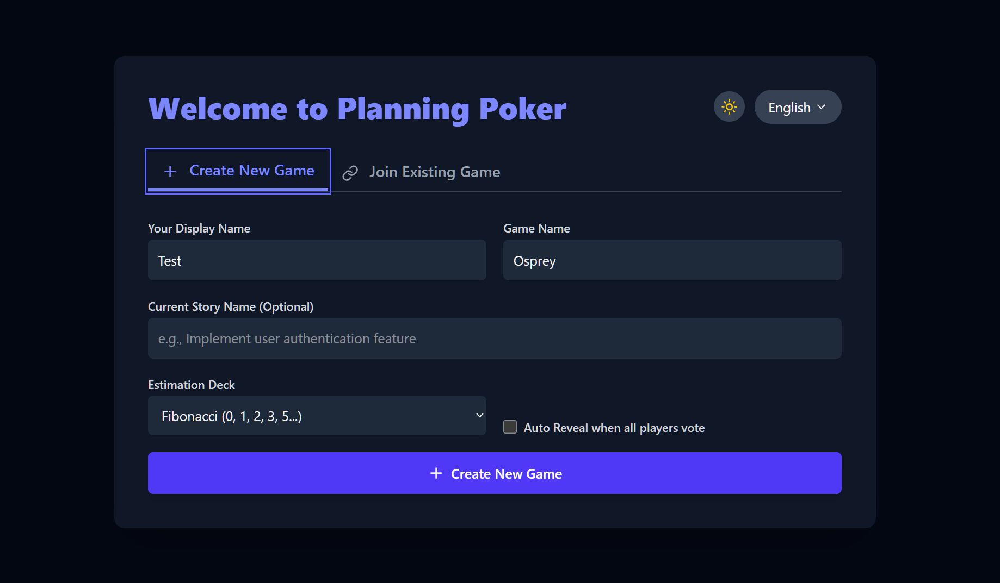
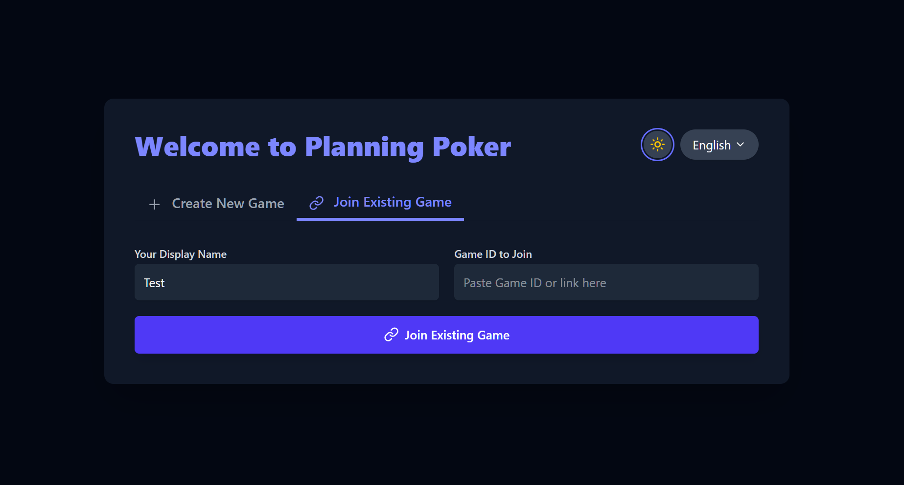

# Planning Poker with Supabase

A real-time Planning Poker application built with React and Supabase.

## Features

- 🎴 Create and join Planning Poker games
- 🔐 Anonymous authentication via Supabase
- ⚡ Real-time updates using Supabase Realtime
- 🎨 Dark/Light theme toggle
- 🌍 Multi-language support (English/Spanish)
- 📊 Fibonacci and T-Shirt sizing decks
- 🤖 Auto-reveal when all players vote

## Setup Instructions

### 1. Create a Supabase Project
1. Go to https://app.supabase.com
2. Create a new project
3. Wait for the project to be ready

### 2. Set Up Database
1. In your Supabase project, go to the SQL Editor
2. Copy the contents of supabase-schema.sql
3. Paste and run it in the SQL Editor

### 3. Clone Repository
1. Repo https://github.com/pankaj9057/planning-poker.git

### 4. Configure Environment Variables
1. Create .env on root (Planning-Poker)
2. Get your Supabase URL and anon key from Project Settings → API
3. Update the .env file with your credentials

Example:

```
VITE_SUPABASE_URL=https://xyzcompany.supabase.co
VITE_SUPABASE_ANON_KEY=public-anon-key
```

### 5. Install and Run
```bash
npm install
npm run dev
```

## Deployment

### Deploy to Vercel

1. Push your code to GitHub (already done!)
2. Go to [Vercel](https://vercel.com)
3. Click "New Project"
4. Import your GitHub repository: `pankaj9057/planning-poker`
5. Configure environment variables:
   - `VITE_SUPABASE_URL`: Your Supabase project URL
   - `VITE_SUPABASE_ANON_KEY`: Your Supabase anonymous key
6. Click "Deploy"

[](https://vercel.com/new/clone?repository-url=https://github.com/pankaj9057/planning-poker)

### Deploy to Netlify

1. Go to [Netlify](https://netlify.com)
2. Click "Add new site" → "Import an existing project"
3. Connect to GitHub and select `pankaj9057/planning-poker`
4. Build settings are auto-detected from `netlify.toml`

# Demo

Live demo: https://pankaj9057.github.io/planning-poker/

<p align="center">
   
   
</p>